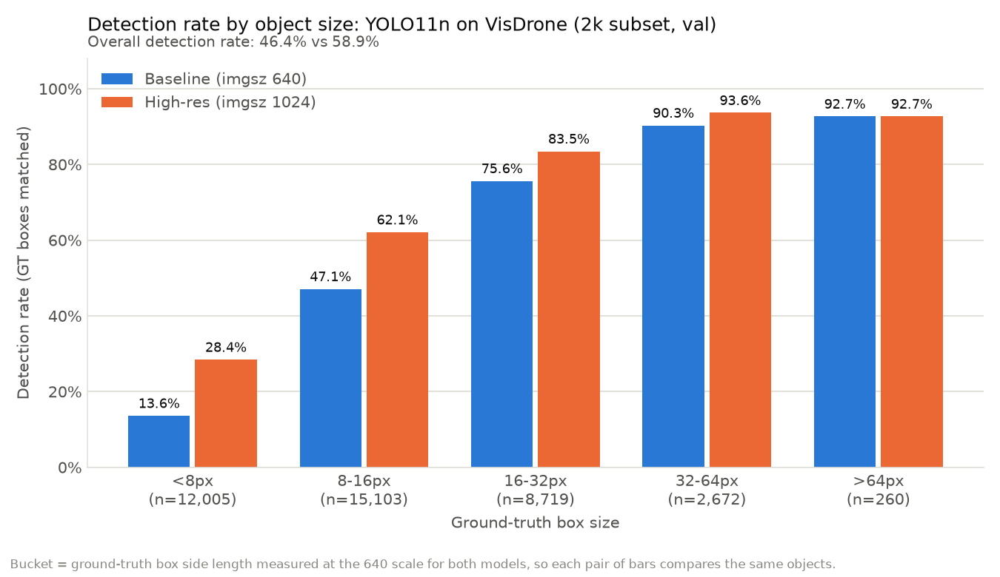
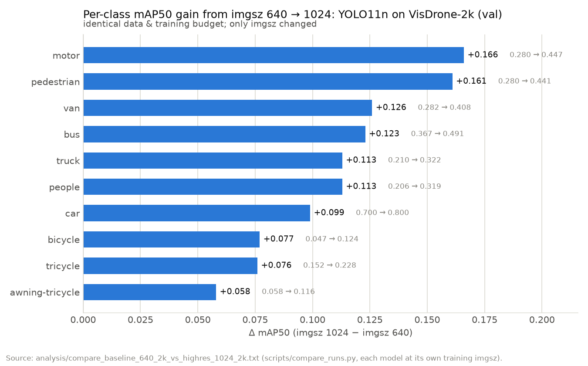
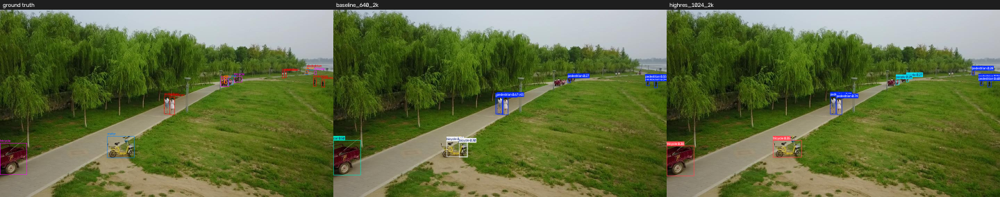
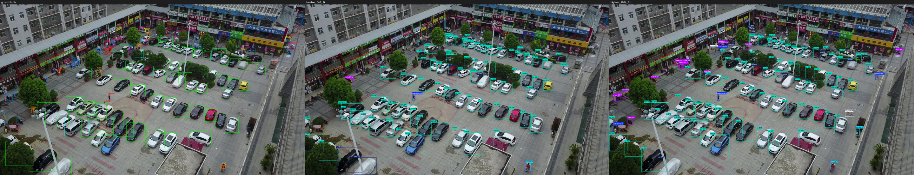

# Small-Object Detection in Drone Imagery


-success)

Training YOLO11n on [VisDrone](https://github.com/VisDrone/VisDrone-Dataset) aerial imagery,
around one controlled experiment: **how much of the small-object problem is simply input
resolution?**

**Answer: a lot.** Raising `imgsz` 640 → 1024 on identical data and training budget lifted
mAP50 by **+43% (0.258 → 0.370)** — with the gains ranked exactly where the hypothesis
predicted: objects that were below the network's stride.

<p align="center">
  
</p>

*Detection rate per object-size bucket (buckets measured at the 640 scale for both models —
same objects, same buckets, only the model changes). The `<8px` bucket — 31% of all objects —
doubles. The `>64px` bucket doesn't move: a perfect internal control.*

---

## The problem

Object detectors downsample aggressively — YOLO11's finest detection head runs at **stride 8**,
so an object smaller than ~8px may contain no anchor point at all. It isn't "hard to detect";
it is **invisible to the training loss**. Drone imagery is the worst case: a pedestrian filmed
from altitude is 7–15 pixels, and after resizing to 640 — often below the stride.

Measured on this dataset (548 val images, 38,759 boxes):

- **70% of objects are under 16px** at the 640 input scale.
- The 5-epoch smoke model's dominant failure is **non-detection, not confusion**: 62.6% of
  objects missed entirely vs 6.3% misclassified — a 10:1 ratio (the fully-trained 640
  baseline narrows this to 53.6%/7.7%, still 7:1). The model's problem is *seeing*, not
  *understanding*.
- Longer training doesn't fix it: 80 epochs lifted mid/large classes by 13–19pt but
  pedestrians by only 4pt. **Training time cannot rescue sub-stride objects; only
  resolution can.** That asymmetry is the experiment's motivation.

## The experiment

Two YOLO11n models, identical in every way — same 2,000-image train subset (seed=42), full
val set, SGD lr0=0.01 pinned, same augmentation, same budget — except `imgsz`: **640 vs 1024**.

| | imgsz 640 | imgsz 1024 | Δ |
|---|---|---|---|
| **mAP50** | 0.258 | **0.370** | **+43%** |
| mAP50-95 | 0.142 | 0.216 | +52% |
| Recall | 0.300 | 0.393 | +9.3pt |
| Precision | 0.380 | 0.490 | +11.0pt |
| Inference | 1.6 ms | 6.9 ms | **×4.3** |

<p align="center">
  
</p>

Reading the results honestly:

- **mAP50-95 rose relatively more than mAP50** (+52% vs +43%): boxes are both found more
  often *and* localized better — a second signature of the resolution mechanism.
- **The two smallest-object classes lead** (motor +0.166, pedestrian +0.161), but per-class
  ordering isn't strictly by size — class is a noisy proxy for object size. Where size is
  measured directly (the bucket chart above), the *relative* gain is perfectly monotonic
  in size (×2.1 → ×1.3 → ×1.1 → ×1.04 → ×1.0).
- **The cost is real and measured:** ×4.3 inference time — still ~145 FPS-equivalent on a
  laptop RTX 3070, but the trade-off is the point: resolution buys recall with compute.

### What it looks like

<p align="center">
  
</p>

*Left → right: ground truth · 640 model · 1024 model. On the distant path the 640 model
finds 4 of 7 pedestrians and mislabels the cargo tricycle as a car; the 1024 model recovers
more of the distant people and labels the tricycle correctly. (Both models still mislabel
the parked motor — lookalike confusion survives resolution.)*

<p align="center">
  
</p>

*A dense parking scene: the 1024 model adds pedestrians and two-wheelers at the margins
that 640 skipped. Panels are downscaled 2× for repo size.*

## What the 1024 model still gets wrong

Honesty section — what the resolution lever did **not** fix:

1. **Extreme density** (317 objects in one frame): recall collapses in packed scenes and
   `max_det=300` becomes a hard ceiling below the object count.
2. **Lookalike twins:** with enough pixels to see, the model now *hesitates* — motor↔bicycle
   confusion is perfectly symmetric (134:134), pedestrian→people jumped 30→263. False
   positives rose 14% vs the baseline. **The bottleneck moved from "can't see" to "can't
   tell apart"** — a problem more resolution cannot fix.
3. **The rare classes stay hard:** bicycle improves ×2.6 yet remains near-worst (0.124) —
   thin geometry, 3% frequency, and the rider stealing the detection compound each other
   (full cases with images: [`analysis/failure_cases_1024.md`](analysis/failure_cases_1024.md)).

Two follow-up hypotheses were then **settled by measurement** rather than intuition:

- **Vertical flip (`flipud`) — rejected before running:** it sounds natural for aerial
  imagery, but a 100-image viewpoint study showed only ~49% of frames are near-nadir — for
  the rest, flipping creates impossible images and erases the posture cue separating
  `pedestrian` from `people` (see [`analysis/flipud_notes.md`](analysis/flipud_notes.md)).
- **Gentler scale augmentation (0.5 → 0.2 at 1024) — ran, and came back
  null-to-slightly-negative (best 0.368 vs 0.370):** tiny-object *detection* rose slightly
  in the predicted buckets, but it traded away larger-bucket detection and full-sweep
  recall — the augmentation both destroys and rescues small objects, and the effects
  roughly cancel. Bonus: both 1024 runs beat 640 by the same margin (+0.110/+0.111), so
  **the +43% is reproduced across two independent runs**, not seed luck. Full analysis in
  [`EXPERIMENTS.md`](EXPERIMENTS.md).

## Dataset notes

VisDrone-DET: 8,629 drone images, 10 classes, ~457K boxes after conversion. Properties we
measured and worked around (full log in [`EXPERIMENTS.md`](EXPERIMENTS.md)):

- **Density:** median 42 objects/image, max 902 (train) / 317 (val).
- **Imbalance:** car is 42% of boxes; awning-tricycle under 1% (45:1). Since mAP
  macro-averages classes, the four rarest classes are 7% of the data but 40% of the metric.
- **Annotation quirks:** 2,597 train boxes extend past image borders; 4 duplicate labels —
  surfaced by our tooling rather than silently clipped.

## Quick start

```bash
git clone https://github.com/gallugassi3/visdrone-small-object-detection.git
cd visdrone-small-object-detection
python -m venv .venv
.venv\Scripts\Activate.ps1        # Windows PowerShell (use: source .venv/bin/activate on Linux)
pip install -r requirements.txt   # torch: see note inside for the CUDA index URL
python check_env.py               # verifies GPU + versions
python download_data.py           # VisDrone via Ultralytics (~2.3GB)
```

> **Note:** Ultralytics downloads datasets to its global `datasets_dir`, which by default
> is *outside* the clone. Either accept that location or point it at the repo first:
> `yolo settings datasets_dir=<repo-path>/datasets` — then continue:

```bash
python make_subset.py             # reproducible 2k train subset (seed=42)
python train.py                   # 640 baseline (~2h on RTX 3070 Laptop)
python train_1024.py              # the experiment (~4.5h)
python scripts/compare_runs.py baseline_640_2k highres_1024_2k
python -m scripts.walkthrough     # watch one image get matched, step by step
# Or skip training: download trained weights from the Releases page
```

## Repository guide

| Path | What it is |
|---|---|
| `train.py` / `train_1024.py` / `train_scale.py` | The experiment configurations (single variable each) |
| `scripts/compare_runs.py` | Unified-protocol comparison — the source of all official numbers |
| `analyze_failures.py` | Error taxonomy: missed / misclassified / false positive |
| `analysis/size_sensitivity.py` | Detection rate as a function of object size |
| `scripts/walkthrough.py` | One image, every matching step printed — watch a metric being born |
| `predict_compare.py` | GT vs model-A vs model-B side-by-side panels |
| `scripts/failure_cases.py` | Finds and renders the cases the strong model still misses |
| `scripts/size_chart.py` / `scripts/delta_chart.py` | The two charts above, generated from the measurement files |
| `EXPERIMENTS.md` | Run log: every experiment, its numbers, its conclusion |
| `analysis/` | Saved measurements, methodology notes, and pre-publication reviews |

<details>
<summary><b>Verification & methodology</b> (click to expand)</summary>

- Official metrics come only from `scripts/compare_runs.py` (unified val protocol on best.pt,
  explicit `data`/`imgsz`); `results.csv` at the best epoch agrees.
- Size buckets are always computed at the 640 scale for both models.
- Two measurement protocols coexist deliberately: detection-rate tools run at conf=0.25
  (the operating point), while mAP runs the full confidence sweep — never compare across
  them. All numbers are val-set; the official test split remains untouched.
- Speed numbers require a matched protocol: architecture-identical models measured under
  different GPU load report different ms/image — we quote the conservative measurement.
- Greedy IoU matching in the analysis tools is a documented lower bound (adversarial test in
  [`analysis/logic_review.md`](analysis/logic_review.md)); it matches COCO-style behavior and
  biases both models equally.
- Before publication the repo passed two reviews: a factual audit
  ([`analysis/repo_review.md`](analysis/repo_review.md) — 9 blockers found and fixed) and an
  adversarial logic verification of every measurement tool (zero bugs; every claim tested
  against hand-computed synthetic cases). The README itself passed the same treatment
  ([`analysis/readme_review.md`](analysis/readme_review.md)), and the Run-4 write-up a
  final one ([`analysis/run4_review.md`](analysis/run4_review.md)).
- `optimizer=auto` was caught silently switching AdamW/SGD by run length — SGD lr0=0.01 is
  pinned across all experiments for comparability.

</details>

## What I'd do next

Ranked by expected return, grounded in the literature on VisDrone small-object detection:

1. **P2 detection head** (stride 4) — the most consistent structural lever in recent
   VisDrone work; same medicine as resolution, but architectural and cheaper at inference.
2. **Class rebalancing / more rare-class data** — the new bottleneck is lookalike
   discrimination, which resolution cannot fix. Copy-paste augmentation is the literature's
   lever for rare classes, but two caveats fit this project exactly: Ultralytics supports it
   only for segmentation labels, and recent work finds nano-scale models overfit to its
   pasting artifacts — so for this stack the honest path is real data or oversampling, not
   synthetic pasting.
3. **Tiling (SAHI-style)** for production-scale images — resolution cost grows quadratically;
   tiling caps it.

---

*Built by [Gal Lugassi](https://github.com/gallugassi3) · Aug 2026 · Questions and feedback welcome via Issues.*